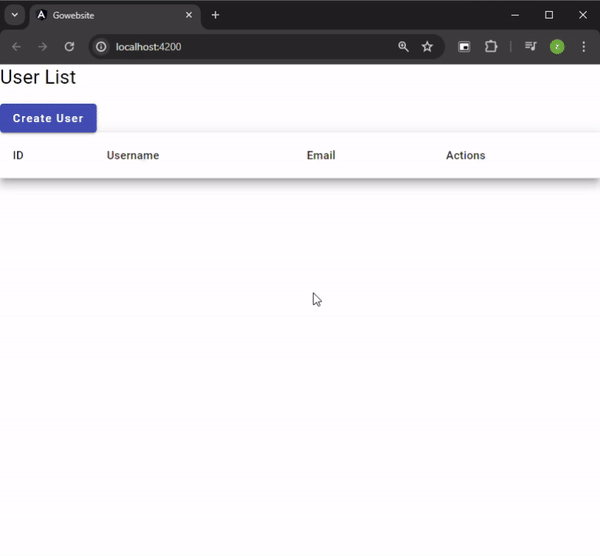
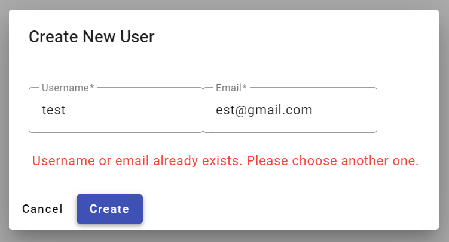

# Zach Lowe's Go and Angular User Management

This project showcases a user management system built with Go for the backend and Angular for the frontend. Users can be created, edited, and deleted with seamless interactions.



## Features

- **User Creation**: Add new users with unique usernames and emails.
- **User Editing**: Update existing user details.
- **User Deletion**: Remove users from the system.

## Error Handling

### User Creation Error


### User Editing Error


## Getting Started

### Prerequisites

- [Go](https://golang.org/doc/install)
- [Node.js](https://nodejs.org/)
- [Angular CLI](https://angular.io/cli)
- PostgreSQL version 10 or higher
  - other libraries:
    - Material components - https://material.angular.io/
    - Angular testing: Jasmine and Karma
    - Echo as web framework - https://echo.labstack.com/
    - Data access - https://github.com/Masterminds/squirrel
    - Go testing Ginkgo and Gomega

### Backend

1. Navigate to the backend directory:
    ```sh
    cd backend
    ```
2. Create a `config.json` file with the following contents:
    ```json
    {
      "database": {
        "host": "localhost",
        "user": "YOUR_USER",
        "password": "YOUR_PASSWORD",
        "dbname": "YOUR_DATABASE",
        "port": 5432,
        "sslmode": "disable"
      },
      "app": {
        "timezone": "America/New_York"
      }
    }
    ```
3. Install dependencies:
    ```sh
    go get ./...
    ```
4. Run the server:
    ```sh
    go run main.go
    ```

### Frontend

1. Navigate to the frontend directory:
    ```sh
    cd frontend
    ```
2. Install dependencies:
    ```sh
    npm install
    ```
3. Serve the app:
    ```sh
    ng serve
    ```

## Usage

- Navigate to `http://localhost:4200` to access the application.
- Use the interface to manage users:
  - **Create**: Add a new user using the "Create User" button.
  - **Edit**: Update user details via the edit button next to each user.
  - **Delete**: Remove a user using the delete button next to each user.

## License

This project is just kind of done by me so feel free to copy.
